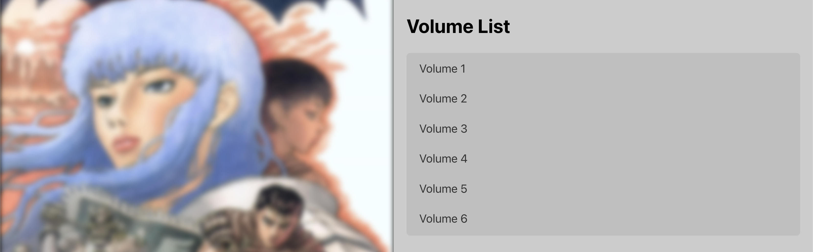

# Sneaky Manga

Sneaky Manga is a  React application designed to provide users with a seamless and immersive manga reading experience. This application is powered by a proprietary API and a curated personal database, enabling the efficient retrieval of manga pages, detailed information, and covers. In other words took F hours to organize and allocate my own personal manga database but it was a truly fun experience !!

`Website Link:` https://julierv.github.io/Sneaky-Manga/#/

`Disclaimer:` This application unequivocally disavows any support for the distribution of copyrighted content. It has been designed with features crafted to prevent infringements of copyrights. The sole purpose of this project is to provide entertainment to users, and it is not intended for the unauthorized distribution or consumption of copyrighted material. I encourage any users to respect intellectual property rights and adhere to applicable laws while utilizing this application.

## Table of Contents

- [Features](#features)
- [Usage](#usage)
- [API](#api)
- [Contributing](#contributing)
- [Installation](#installation)

## Features

- View a list of manga with cover images.
- Clickable manga covers leading to detailed manga information.
- Dynamic loading of manga volumes and cover images.
- Image viewer to explore manga volumes.
- Responsive design for various screen sizes.

## Usage

- Browse the list of manga on the main page.
- Click on a manga cover to view detailed information.
- Explore manga volumes and covers using the image viewer.

## API

The application uses a private NodeJS API is used to fetch manga information and covers.

## Contributing

- Fork the repository.
- Create a new branch: `git checkout -b feature/my-feature`.
- Make your changes and commit them: git commit -m `Add my feature`.
- Push to the branch: `git push origin feature/my-feature`.
- Open a pull request.
All changes are welcomed apart from those that could compromise copyright. For instance trying to deblur the manga panels in the ImageViewer component.

## Installation

- Clone repository
- cd into the react folder
- run `npm install` to install dependencies
